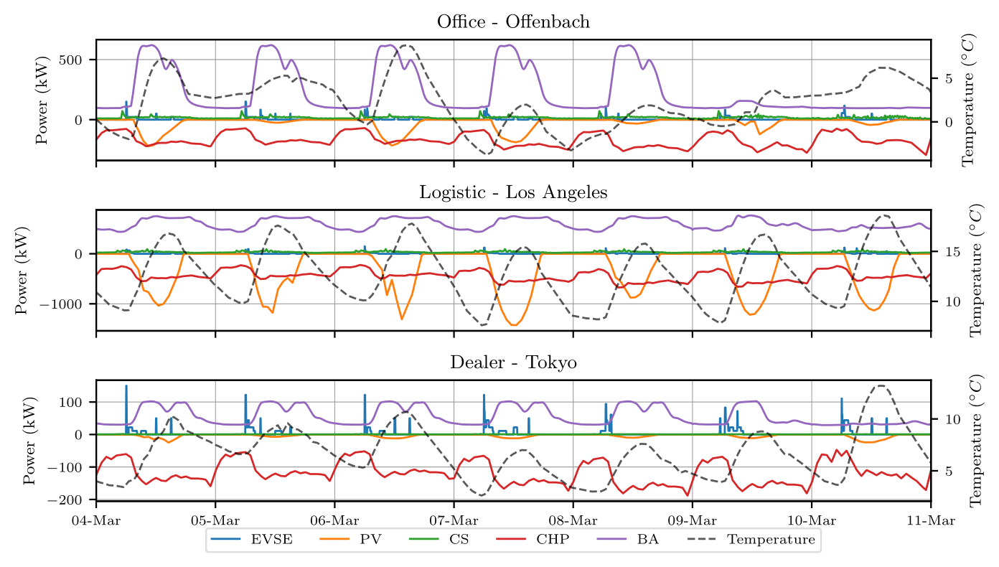

# Synthetic Industrial Dataset for Energy Disaggregation (SIDED)

[](https://figshare.com/s/f824da90af2d8318de6a)
[](https://huggingface.co/datasets/YourUsername/YourDatasetName)
[](https://arxiv.org/abs/2506.20525)

---

### Introduction
Non-Intrusive Load Monitoring (NILM) in the industrial sector is critically limited by the scarcity of high-quality, public datasets, often due to privacy and security concerns. To address this gap, we introduce the **Synthetic Industrial Dataset for Energy Disaggregation (SIDED)**.

SIDED is a novel, open-source dataset generated using a high-fidelity Digital Twin simulator that has been carefully calibrated with real-world operational data. It is specifically designed to provide a rich and diverse benchmark for NILM research in industrial environments, where appliance behavior is systematically different and more complex than in residential settings.

### How to Cite
If you use the SIDED dataset or the AMDA method in your research, please cite the following paper:

```bibtex
@misc{internò2025industrialenergydisaggregationdigital,
      title={Industrial Energy Disaggregation with Digital Twin-generated Dataset and Efficient Data Augmentation}, 
      author={Christian Internò and Andrea Castellani and Sebastian Schmitt and Fabio Stella and Barbara Hammer},
      year={2025},
      eprint={2506.20525},
      archivePrefix={arXiv},
      primaryClass={cs.LG},
      url={[https://arxiv.org/abs/2506.20525](https://arxiv.org/abs/2506.20525)}, 
}
```

### Key Features
* **High-Fidelity Simulation:** Generated by a Digital Twin based on physical models for all machinery. The simulator was calibrated against real-world data, achieving an accumulated discrepancy error of less than 3% over a full year for the reference configuration (Office in Offenbach, Germany).
* **Diverse Scenarios:** Covers 9 distinct configurations, encompassing 3 industrial facility types (Office, Dealer, Logistics) across 3 geographic locations (Offenbach, Los Angeles, Tokyo) to capture a wide variety of load profiles, weather conditions, and operational schedules.
* **Complex Appliance Modeling:** Includes data for five key industrial appliances, representing consumers (EVSE, CS, BA), producers (PV, CHP), and devices with continuous and variable power profiles.
* **Standardized & Accessible:** The dataset is fully compatible with the **NILMTK** (https://github.com/nilmtk/nilmtk) toolkit and is publicly available on GitHub.

### Dataset Structure

SIDED provides nine full years of data, representing one year for each of the nine unique facility configurations.

| Characteristic         | Description                                                                                                                           |
| :--------------------- | :------------------------------------------------------------------------------------------------------------------------------------ |
| **Total Configurations** | 9 (3 Facility Types × 3 Locations)                                                                                         |
| **Facility Types** | Office, Dealer, Logistics Center                                                                                           |
| **Geographic Locations**| Offenbach (Germany), Los Angeles (USA), Tokyo (Japan)                        _**This is a placeholder, please replace with your actual URL.**_ |
| **Appliances Tracked** | 5: Combined Heat and Power (CHP), Cooling Systems (CS), EV Supply Equipment (EVSE), Photovoltaic (PV), and Background Appliances (BA). |
| **Duration** | 9 years total (one complete calendar year per configuration).                                                                    |
| **Sampling Rate** | $\tfrac{1}{60} \text{Hz}$ (one-minute intervals).                                                                                 |
| **Total Data Points** | 4,730,400 (525,600 per configuration).                                                  _**This is a placeholder, please replace with your actual URL.**_ |


*Example week from SIDED showing the different behaviors for Office (Offenbach), Logistic (Los Angeles), and Dealer (Tokyo) configurations. Negative power values indicate generation from PV and CHP systems.*

### Appliance Characteristics
The dataset is designed to reflect the complexity of real-world industrial loads by including appliances from the following categories as defined in the associated paper:

* **Constantly-on Variable Appliances:** Devices that are always on but have variable consumption, such as the **CHP**.
* **Periodical:** Appliances with periodic behavior, like **EVSE** and **PV** systems.
* **Seasonal:** Consumption patterns are influenced by seasons and weather, including **PV**, **CHP**, and **CS**.
* **Multi-pattern:** Appliances with multiple modes of operation. All five appliances in SIDED fall into this category.
* **Consumers:** Devices that consume energy, such as **EVSE**, **CS**, and **BA**.
* **Producers:** Devices that generate energy, such as **PV** and **CHP**.

### Data Features (Columns)
Each of the 9 configurations contains a time series file with the following columns. All power values refer to the real power of the appliance.

* **Time:** Timestamp for the reading.
* **Aggregate:** Aggregate real power (W) measured at the main meter.
* **EVSE:** Electric Vehicle Supply Equipment real power (W).
* **PV:** Photovoltaic system real power (W) (production is negative).
* **CS:** Cooling Systems real power (W).
* **CHP:** Combined Heat and Power real power (W) (production is negative).
* **BA:** Background Appliances real power (W).
* **TAmbient:** Ambient temperature in °C.
* **RadiationDiffuse:** Diffuse sky radiation in W/m².
* **RadiationDirect:** Direct solar radiation in W/m².

### Associated Research: The AMDA Method
This dataset was introduced in the paper: **"Industrial Energy Disaggregation with Digital Twin-generated Dataset and Efficient Data Augmentation"**.

The paper also proposes **Appliance-Modulated Data Augmentation (AMDA)**, a novel and computationally efficient data augmentation technique specifically designed to handle the continuous and overlapping nature of industrial energy signals. AMDA enhances model training by intelligently scaling appliance signals based on their relative power contribution, which significantly improves the generalization of NILM models in out-of-sample scenarios.

We highly recommend reading the paper to understand the full context of the dataset and to leverage a state-of-the-art method for training robust industrial NILM models.
