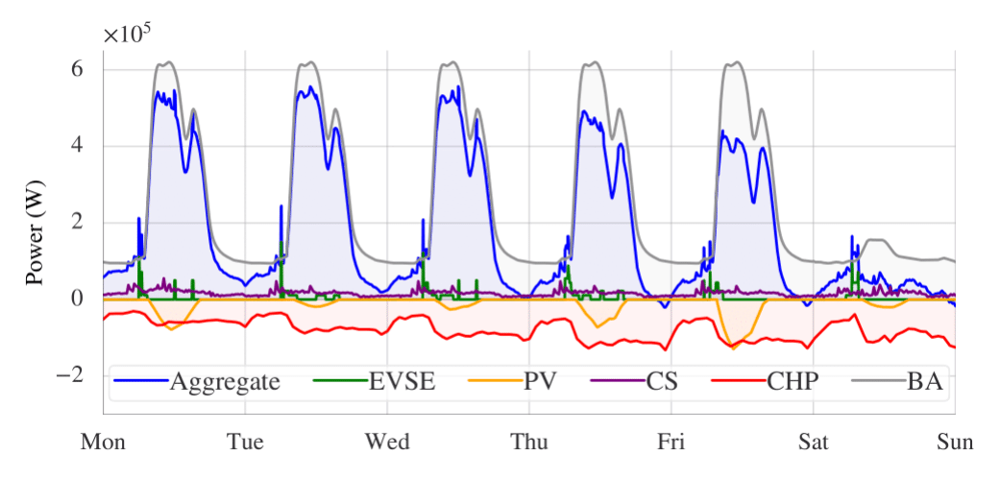

## Synthetic Industrial Dataset for Energy Disaggregation (SIDED)

### Download the Dataset
To access and download the SIDED dataset, click the button below:
)

## Introduction
Monitoring the electrical consumption of individual appliances is crucial in modern smart monitoring systems. Non-Intrusive Load Monitoring (NILM) techniques disaggregate the main meter signal of a building into its independent componentss. This repository introduces the SIDED dataset, a synthetic industrial dataset for energy disaggregation, crafted using Digital Twin technology. While most NILM methods cater to household settings, they may falter in industrial contexts due to systematic differences in the behavior of industrial appliances.

| Topic                                      | Link                                          |
|--------------------------------------------|-----------------------------------------------|
| Number of Appliances                       | 5                                             |
| Time                                       | 9 year in total                               |
| Sampling Rate                              | $\tfrac{1}{60} Hz$                            |
| Scope                                      | Industrial NILM                               |
| Compatible to NILMTK?                      | Yes                                           |
| Where can I learn more about SynD?         | Publication soon                              |

## Dataset Description
SIDED is a public industrial dataset that includes energy consumption records for nine smart company buildings over a complete calendar year, with energy readings taken at one-minute intervals. The dataset replicates energy consumption patterns for three distinct types of buildings:
- Offices
- Dealerships
- Logistics centers

It covers three different geographical locations:
- Offenbach am Main in Germany
- Los Angeles in the USA
- Tokyo in Japan

The dataset consists of 9 simulations, each with 525,600 individual data points, making a total of 4,730,400 distinct labels. It includes various appliances and their energy signals, such as Combined Heat and Power (CHP), Cooling Machines (CS), Electric Vehicle Charging Station (EVSE), Photovoltaic System (PV), and Background Appliances (PB).

## Features
Detailed insights into the energy consumption patterns of each building are provided by the following features:

- Time: Represents the time step in seconds
- Aggregate: Aggregate signal in KWh
- RadiationDiffuse: Diffuse sky radiation in W/m^2
- RadiationDirect: Direct radiation in W/m^2
- EVSE: Plug-in electric vehicle station total power in KWh
- PV: Photovoltaic system total power in KWh
- CS: Cooling Systems total power in  KWh
- CHP: Combined heat and power total power in  KWh
- PB: Backgorund appliance total power in  KWh
- TAmbient: Ambient temperature in °C		
